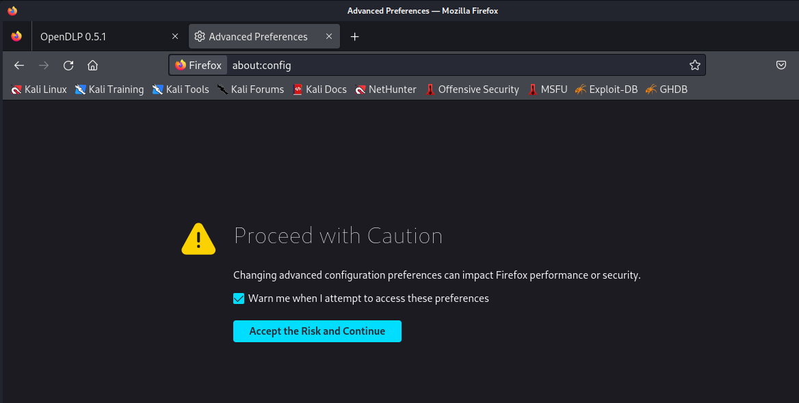

# Fixing Firefox Error When Importing OpenDLP Certificate
If you encounter an error like the one shown in the image below when importing the OpenDLP certificate, follow these steps to resolve it:

## Step 1
Open Firefox preferences:

## Step 2
Navigate to about:config:

## Step 3
Change the security.tls.min.version to 1:

